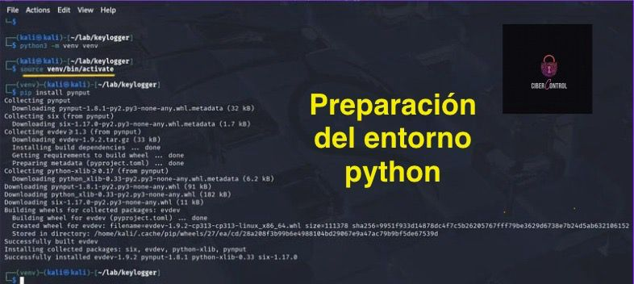
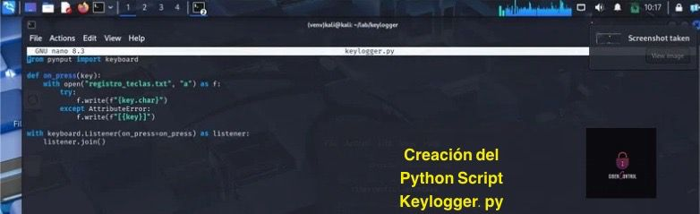
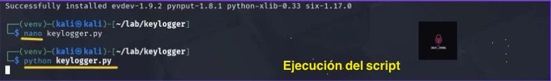
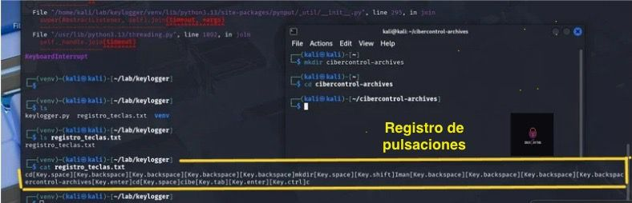

# keylogger

Laboratorio de Captura de Teclas (Keylogger), con Python-Script

Las pulsaciones del teclado de la víctima se registran en un archivo, el cual puede ser enviado posteriormente por correo electrónico u otro canal de exfiltración.

1: Preparación del entorno

●  En Kali Linux 2025.1c, se configura un entorno virtual en Python para aislar el laboratorio. 

●  Se instalan librerías esenciales como hashtag#pynput, hashtag#evdev, hashtag#pythonxlib y hashtag#six, necesarias para la captura de eventos del teclado. 

 2: Creación y ejecución del script

 
 
● Editar el archivo ".py", que contiene el código que escucha y registra cada pulsación del teclado. 

● Ejecutar el script desde el entorno virtual, iniciando la captura.

3: Registro de pulsaciones

●  El script captura entradas del teclado y las guarda en registro "teclas.txt". 

●  En la imagen se muestra parte del contenido del archivo de texto, revelando cómo se registran incluso teclas especiales como [Key.space], [Key.backspace], etc.

●  Por ejemplo, estas son algunas de las señales que un keylogger puede guardar:

     ● ● [Key.space] — indica que se presionó la tecla espacio
 
     ● ● [Key.backspace] — indica que se presionó la tecla retroceso (borrar)
 
     ● ● [Key.enter] — indica que se presionó la tecla enter

 

Este análisis se realizó en un entorno controlado con fines educativos y defensivos. 
Laboratorio disponible en pdf: https://lnkd.in/dn73UqNk
